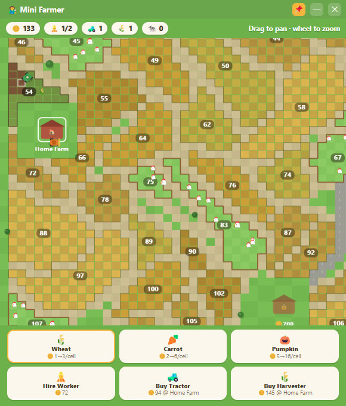
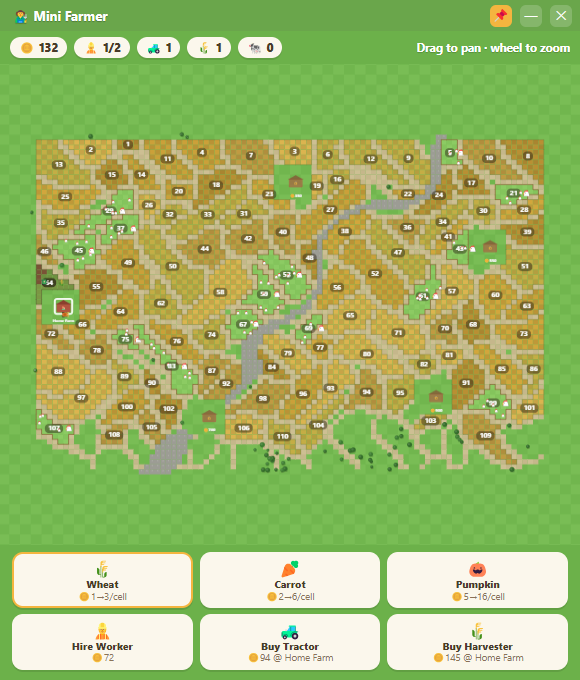

# 🧑‍🌾 Mini Farmer

A tiny farm-management game that lives in a **small always-on-top floating window** — built to *not* demand your attention. Buy land, hire workers, send out tractors and harvesters, and let the farm run itself while you work on other things.

No engine, no frameworks: one HTML file of vanilla canvas JavaScript inside a frameless Electron window.

| Managing the farm | The parcel map |
| :---: | :---: |
|  |  |

## Features

- 🗺️ **Big procedural map** — ~110 organically-shaped field parcels packed between dirt roads, a winding highway, and tree clusters. Deterministic layout: the same world every time you play.
- 🚜 **Autonomous crews** — you never drive. Workers board tractors (planting) and harvesters (reaping) and work fields cell by cell. Bigger fields genuinely take longer — or more machines.
- 👷 **Workers ≠ machines** — every vehicle needs a free worker to run. Balancing your labor pool against your machine fleet is the core decision.
- 🏠 **Five farm locations** — buy farms across the map; machines are purchased at (and return to) your active farm, so where you station your fleet matters.
- 🌾 **Three crops** — wheat (fast, cheap), carrots, pumpkins (slow, lucrative). Set each field's crop; crops grow in real time, **even while the app is closed**.
- 🐄 **Pastures & animals** — some parcels come with wandering cows, sheep, or chickens. Buy the pasture and they earn passively (milk, wool, eggs) — no worker needed, including offline (capped at 4 h).
- 💾 **Auto-save** — progress is saved locally every few seconds.

## Installation

Requires [Node.js](https://nodejs.org/) 18 or newer.

```bash
git clone https://github.com/lucasbruch/MiniFarmer.git
cd MiniFarmer
npm install
npm start
```

The game opens as a small frameless window pinned above your other windows (toggle with 📌).

## How to play

Start with 150 coins, 2 workers, 1 tractor, 1 harvester, and one field.

1. **Pick a seed** in the bottom bar, then **click one of your fields** to set what gets planted there.
2. Your crews handle the rest: an idle worker takes a machine out, works the nearest cell that needs it, and moves on.
3. **Click unowned parcels** (mustard-colored, numbered) to buy them. Green fenced parcels are pastures — their animals earn for you once bought.
4. Scale up: hire workers, buy machines, buy farms closer to your fields.

### Controls

| Input | Action |
| --- | --- |
| Drag / `WASD` / arrow keys | Pan the map |
| Mouse wheel | Zoom (all the way out = parcel overview) |
| Click field | Buy it / set its crop |
| Click farm | Buy it / make it your active farm (machines are bought there) |
| Hover anything | Info in the top-right status bar |
| 📌 | Toggle always-on-top |

## Development

- [main.js](main.js) — Electron shell (frameless floating window)
- [index.html](index.html) — the entire game: world generation, crew AI, rendering, save/load
- [tools/capture.js](tools/capture.js) — regenerates the README screenshots (`npx electron tools/capture.js`)

## License

[MIT](LICENSE)
