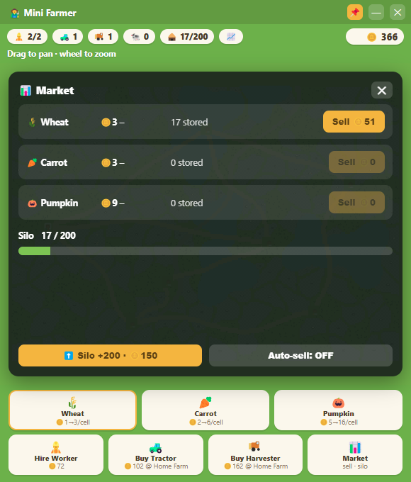
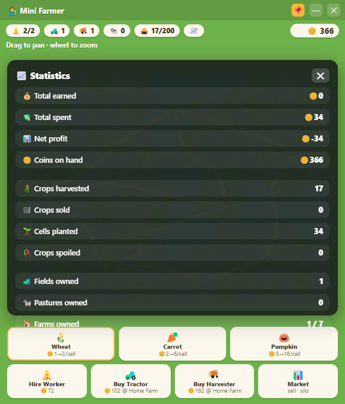

# 🧑‍🌾 Mini Farmer

A cozy farm-management game that lives in a **small always-on-top floating window** — built to *not* demand your attention. Buy land across a big procedural map, hire workers to drive tractors and harvesters, store your crops in a silo, and sell into a fluctuating market. Set it up, then let it run while you work on other things.

No engine, no frameworks: one HTML file of vanilla canvas JavaScript inside a frameless Electron window.


| Managing the farm | The market | Statistics |
| :---: | :---: | :---: |
|  |  |  |

## Features

- 🗺️ **Big procedural world** — a ~6× map of naturally-shaped field parcels packed between winding dirt roads, a highway, lakes, and forest valleys. Deterministic layout, so it's the same world every time.
- 🧭 **Buy land & farms** — unowned parcels are a cool blue-gray; click to buy (bigger + farther = pricier). Own several of the **seven farm locations** and base your machines where the work is.
- 🚜 **Autonomous crews** — you never drive. Workers board tractors (planting) and harvesters (reaping) and work fields cell by cell, prioritizing land near their home farm. Bigger fields take longer, or more machines.
- 👷 **Workers ≠ machines** — every vehicle needs a free worker. Balancing your labor pool against your fleet is the core decision.
- 🛣️ **Road logistics** — vehicles path-find along the road network (and drive faster on it), routing around lakes. Where you station your machines genuinely matters.
- 🏬 **Silo & market** — harvests fill a silo instead of paying instantly. Each crop's price drifts on its own cycle, so you decide *when to sell*. Upgrade silo capacity, or flip on auto-sell to stay hands-off. When the silo fills, harvesting pauses — and crops left standing too long spoil.
- 🐄 **Pastures & animals** — some parcels come with wandering cows, sheep, or chickens. Buy the pasture and they earn passively (milk, wool, eggs), even while the app is closed (capped at 4 h).
- 📈 **Statistics** — track total earned, spent, net profit, crops harvested / sold / planted / spoiled, and holdings.
- 💾 **Runs unattended** — real-time (and offline) growth, auto-save, and always-on-top so it keeps working while you don't.

## Installation

Requires [Node.js](https://nodejs.org/) 18 or newer.

```bash
git clone https://github.com/lucasbruch/MiniFarmer.git
cd MiniFarmer
npm install
npm start
```

The game opens as a small frameless window pinned above your other windows (toggle with 📌).

## How to play

Start with 400 coins, 2 workers, 1 tractor, 1 harvester, and one free field next to your Home Farm.

1. **Pick a seed** in the bottom bar, then **click one of your fields** to set what grows there. Your crews plant and harvest it automatically.
2. **Buy land** — click blue-gray parcels to purchase them; click a locked 🔒 farm to buy it and make it your active base (new machines are delivered there).
3. **Sell smart** — harvests pile up in your silo. Open the **📊 Market** (dock button or click the silo chip) and sell when prices are high; different crops peak at different times.
4. **Scale up** — hire workers, buy tractors/harvesters, grab pastures for passive income, upgrade your silo.

### Controls

| Input | Action |
| --- | --- |
| Drag / `WASD` / arrow keys | Pan the map |
| Mouse wheel | Zoom (all the way out = whole world) |
| Click field | Buy it / set its crop |
| Click farm | Buy it / make it your active farm |
| Click silo chip or 📊 | Open the market |
| Hover anything | Info in the top-right status bar |
| 📌 | Toggle always-on-top |

## Development

- [main.js](main.js) — Electron shell (frameless floating window)
- [index.html](index.html) — the entire game: world generation, A* road path-finding, crew AI, market, rendering, save/load
- [tools/capture.js](tools/capture.js) — regenerates the README screenshots (`npx electron tools/capture.js`)

## License

[MIT](LICENSE)
